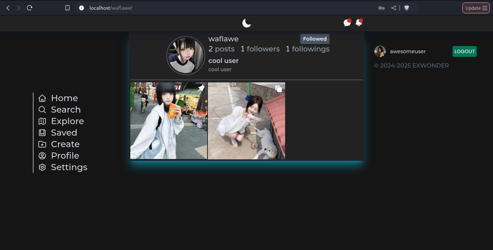
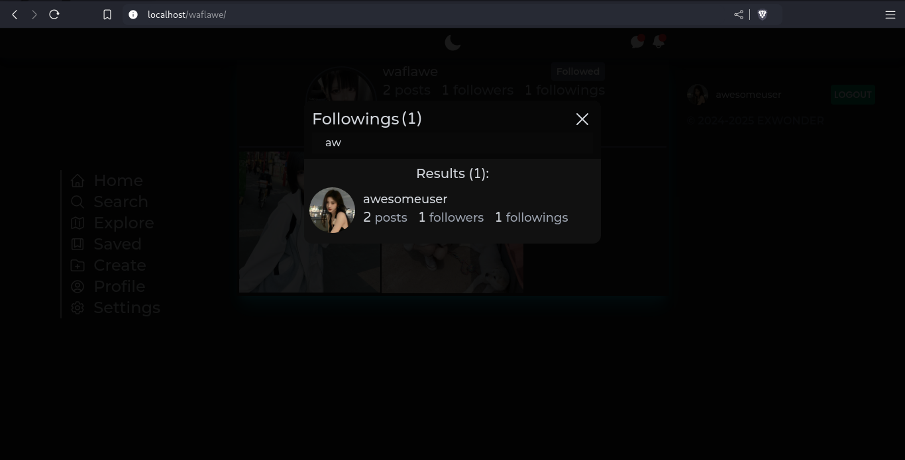
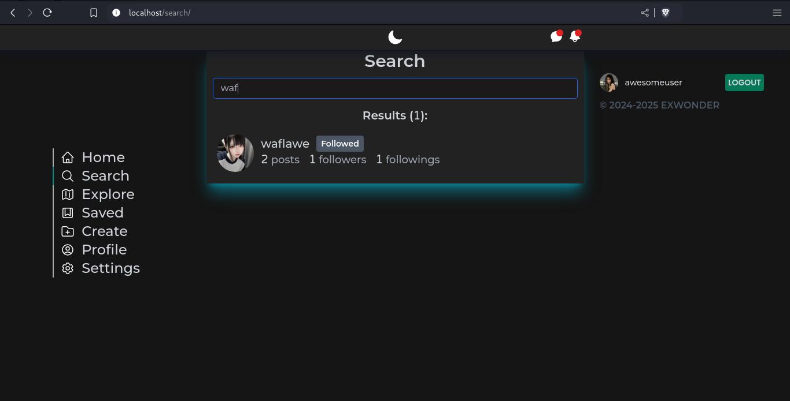

- [eXwonder-frontend](#exwonder-frontend)
  - [Установка](#installation)
  - [Краткое описание функционала](#description)
  - [Скриншоты](#screenshots)
  - [Лицензия](#license)

<!-- TOC --><a name="exwonder-frontend"></a>

# eXwonder-frontend

Frontend клиент для онлайн хостинга картинок с элементами соц-сети **eXwonder**, являющегося по функционалу урезанной версией
Instagram. Код написан на JavaScript фреймворке [Vue 3](https://vuejs.org/), для стилизации использовался
[TailwindCSS](https://tailwindcss.com/) и [SCSS](https://sass-lang.com/). Проект в абсолютно большей части
адаптивен под разные размеры экрана.

<!-- TOC --><a name="installation"></a>

## Установка

Перед использованием клиента убедитесь, что у вас установлен и запущен **backend для eXwonder**
([репозиторий тут](https://github.com/waflawe/eXwonder-backend/)).

1. Клонируем репозиторий:

```cmd
git clone https://github.com/waflawe/eXwonder-frontend.git
cd eXwonder-frontend/
```

2. Ставим зависимости через `npm`, `yarn` или `bun`:

```cmd
bun install
```

3. Запускаем проект с помощью `npm`, `yarn` или `bun`:

```cmd
bun dev
```

4. Открываем в интернет-обозревателе путь `http://localhost:80/`
5. Наслаждаемся
<!-- TOC --><a name="description"></a>

## Краткое описание функционала

Доступно [здесь](https://github.com/waflawe/eXwonder-backend/blob/main/README.md).

<!-- TOC --><a name="screenshots"></a>

## Скриншоты

1. Создание аккаунта:<br>
   
2. Вход в аккаунт:<br>
   
3. Новости:<br>
   
4. Исследование:<br>
   
5. Создание поста:<br>
   
6. Аккаунт:<br>
   
7. Настройки аккаунта:<br>
   
8. Просмотр поста:<br>
   
9. Просмотр подписок пользователя:<br>
   
10. Глобальный поиск пользователей:<br>
    
11. Сохраненные посты:<br>

<!-- TOC --><a name="license"></a>

## Лицензия

У этого проекта [MIT лицензия](https://github.com/waflawe/eXwonder-frontend/blob/main/LICENSE).
