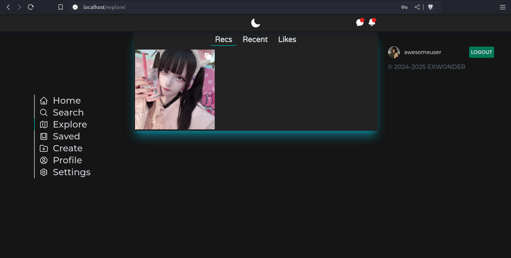
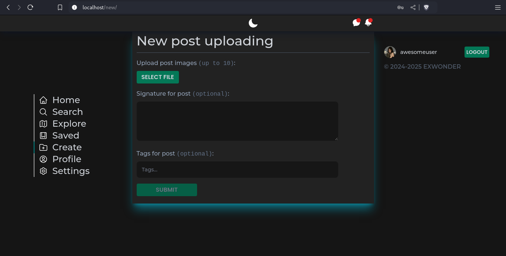

- [eXwonder-frontend](#exwonder-frontend)
  - [Установка](#installation)
  - [Краткое описание функционала](#description)
  - [Скриншоты](#screenshots)
  - [Лицензия](#license)

<!-- TOC --><a name="exwonder-frontend"></a>

# eXwonder-frontend

__Frontend__ клиент для полноценной социальной сети, основанной на картинках `eXwonder`, вдохновленной `Instagram`. 
Код написан на __[Vue.js 3](https://vuejs.org/)__, для стилизации использовались __[TailwindCSS](https://tailwindcss.com/)__ и __[SCSS](https://sass-lang.com/)__. 
Верстка проекта адаптивна под разные размеры экрана, поддерживаются две темы.

<!-- TOC --><a name="installation"></a>

## Установка

Перед использованием клиента убедитесь, что у вас установлена и запущена __[Backend часть](https://github.com/involved-entity/eXwonder-backend/)__ проекта.

1. Клонируем репозиторий:

```cmd
git clone https://github.com/involved-entity/eXwonder-frontend.git
cd eXwonder-frontend/
```

2. Ставим зависимости через `npm`, `yarn` или `bun`:

```cmd
bun install
```

3. Запускаем проект с помощью `npm`, `yarn` или `bun`:

```cmd
bun dev
```

4. Открываем в интернет-обозревателе путь `http://localhost:80/`
5. Наслаждаемся
<!-- TOC --><a name="description"></a>

## Краткое описание функционала

Доступно [здесь](https://github.com/involved-entity/eXwonder-backend/blob/main/README.md).

<!-- TOC --><a name="screenshots"></a>

## Скриншоты

1. Создание аккаунта:<br>
   
2. Вход в аккаунт:<br>
   
3. Новости:<br>
   
4. Исследование:<br>
   
5. Создание поста:<br>
   
6. Мессенджер 1:<br>
   
7. Мессенджер 2:<br>
   
8. Аккаунт:<br>
   
9. Настройки аккаунта 1:<br>
   
10. Уведомления и настройки аккаунта 2:<br>
   
11. Просмотр поста:<br>
   
12. Просмотр подписок пользователя:<br>
   
13. Глобальный поиск пользователей:<br>
    
14. Сохраненные посты:<br>
    
<!-- TOC --><a name="license"></a>

## Лицензия

У этого проекта [MIT лицензия](https://github.com/involved-entity/eXwonder-frontend/blob/main/LICENSE).
