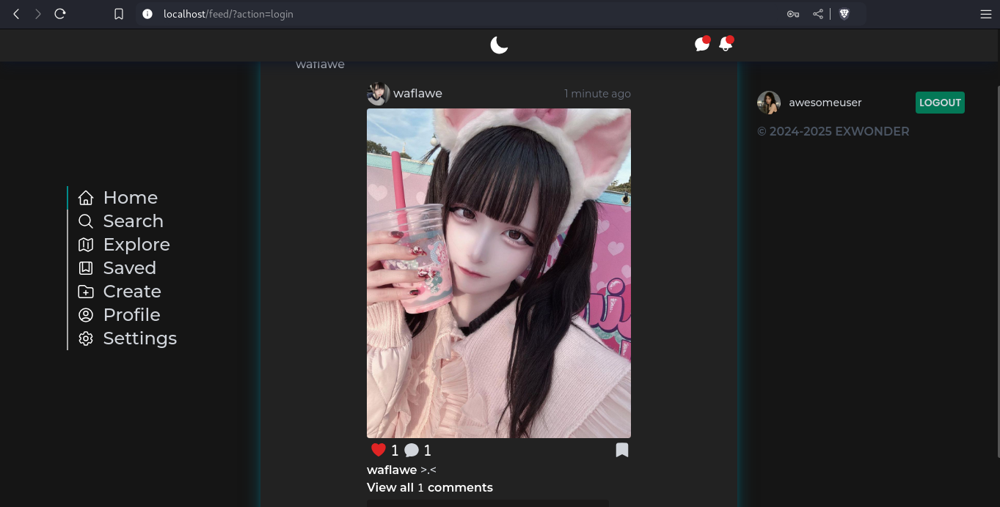
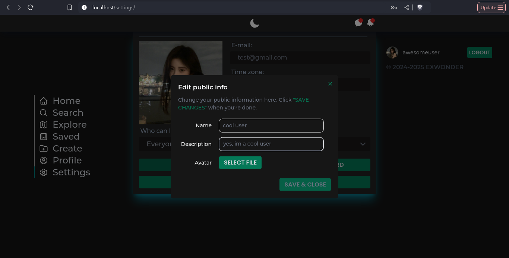
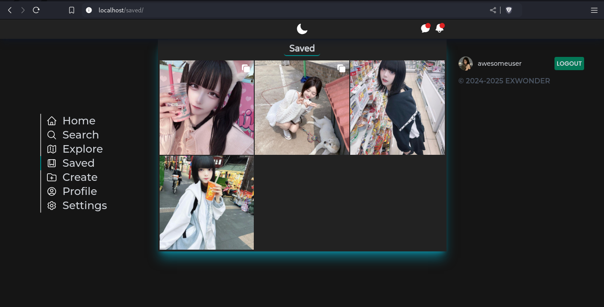

# eXwonder-frontend
Frontend клиент для онлайн хостинга картинок __eXwonder__, являющегося по функционалу урезанной версией 
Instagram. Код написан на JavaScript фреймворке [Vue 3](https://vuejs.org/), для стилизации использовался 
[TailwindCSS](https://tailwindcss.com/) и [SCSS](https://sass-lang.com/). Проект в абсолютно большей части 
адаптивен под разные размеры экрана.
## Установка
Перед использованием клиента убедитесь, что у вас установлен и запущен __backend для eXwonder__ 
([репозиторий тут](https://github.com/waflawe/eXwonder-backend/)).
1. Клонируем репозиторий:
```cmd
git clone https://github.com/waflawe/eXwonder-frontend.git
cd eXwonder-frontend/
```
2. Запускаем проект с помощью `npm` или `yarn`:
```cmd
yarn run dev
```
3. Открываем в интернет-обозревателе путь `http://localhost:3000/`
4. Наслаждаемся
## Краткое описание функционала
Доступно [здесь](https://github.com/waflawe/eXwonder-backend/blob/main/README.md).
## Скриншоты
1. Создание аккаунта:
   
2. Вход в аккаунт:
   
3. Новости:
   
4. Исследование:
   
5. Создание поста:
   
6. Аккаунт:
   
7. Настройки аккаунта:
   
8. Просмотр поста:
   
9. Просмотр подписок пользователя:
   
10. Глобальный поиск пользователей:
    
11. Сохраненные посты:
    
## Лицензия
У этого проекта [MIT лицензия](https://github.com/waflawe/eXwonder-frontend/blob/main/LICENSE).
